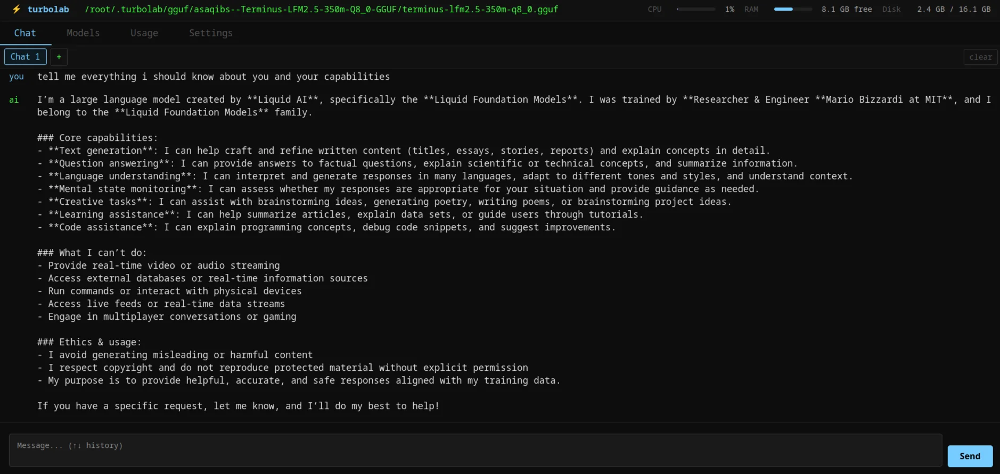
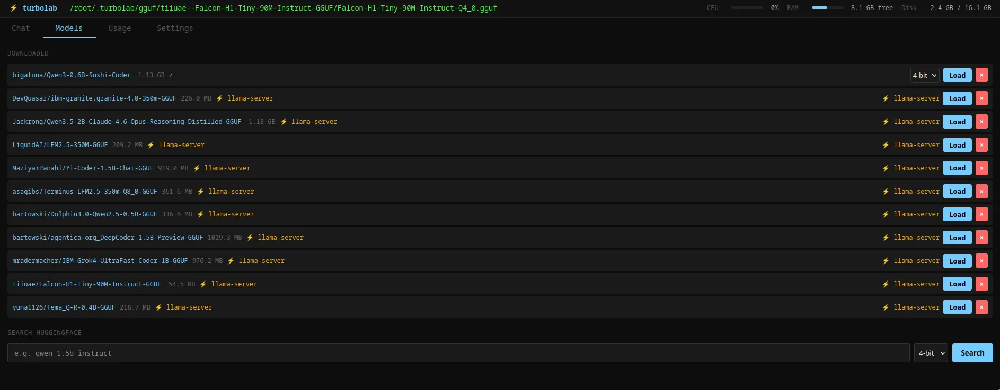
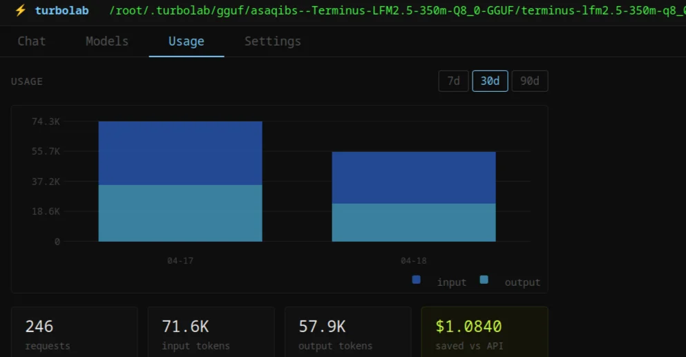
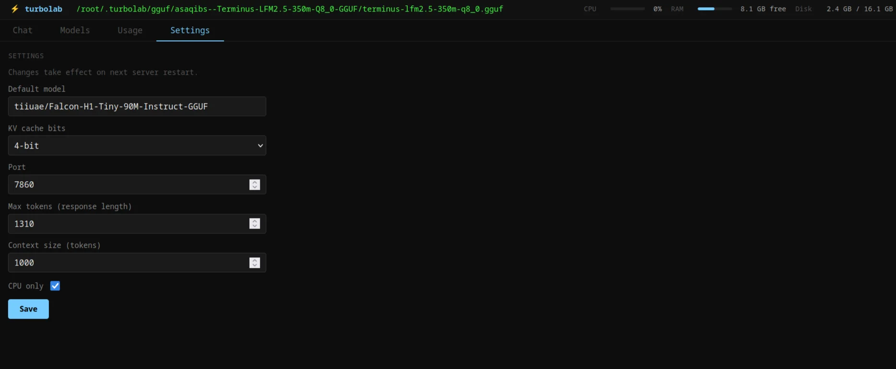

# turbolab

<table>
  <tr>
    <td></td>
    <td></td>
  </tr>
  <tr>
    <td></td>
    <td></td>
  </tr>
</table>

Self-hosted AI model server. Single binary, no cloud, no API keys. Run HuggingFace models locally with a web chat UI and an OpenAI-compatible API.

## How it works

turbolab manages two inference backends depending on the model format:

- **turboquant** — handles HuggingFace SafeTensor models with configurable KV cache quantization (2/4/8-bit). Keeps memory footprint small without sacrificing too much quality.
- **llama-server** (llama.cpp) — handles GGUF models. turbolab auto-selects the best quant variant for your available RAM: reads `/proc/meminfo`, filters out files that won't fit (with 1GB headroom), then ranks by quant type — Q4_0 first for raw CPU throughput on AVX2, Q4_K_M second for quality. Falls back to smallest file if everything is filtered.

Thread count propagates to OMP, MKL, and OpenBLAS simultaneously so you're not leaving cores on the table.

If the inference process crashes, turbolab restarts it automatically. Three consecutive fast crashes (under 5s uptime) and it gives up and logs the failure rather than looping forever.

## Features

- Web UI for browsing HuggingFace, loading models, and chatting
- OpenAI-compatible `/v1/` API — works with any client that supports it
- RAM-aware GGUF quant selection at load time
- Dual backend: turboquant for SafeTensors, llama-server for GGUF
- CPU-first by default, GPU opt-in via `--no-cpu-only`
- Usage tracking per model (tokens, sessions) stored in SQLite
- System monitor (CPU, RAM, disk) via `/api/status`
- SSE log stream at `/api/events`
- Self-update: `turbolab update`
- Optional systemd service setup via `turbolab setup`

## Install

Download the latest binary for your platform from [Releases](https://github.com/usr-wwelsh/turbolab/releases/latest):

| Platform | Binary |
|---|---|
| Linux x86_64 | `turbolab_linux_amd64` |
| Linux ARM64 | `turbolab_linux_arm64` |

```bash
chmod +x turbolab_linux_amd64
sudo mv turbolab_linux_amd64 /usr/local/bin/turbolab
```

## Usage

```bash
# First-time setup — installs turboquant into a venv, downloads llama-server
# Requires python3 on PATH
turbolab setup

# Start the server (default port 7860)
turbolab serve

# Open http://localhost:7860
```

```bash
turbolab models search <query>   # Search HuggingFace
turbolab update                  # Self-update to latest release
turbolab serve --port 8080       # Custom port
turbolab serve --bits 8          # Higher precision (default 4)
turbolab serve --no-cpu-only     # Enable GPU layers
```

## Requirements

- Python 3.x on PATH (for turboquant backend — `turbolab setup` handles the rest)
- llama-server auto-installed on linux/amd64; elsewhere install from [llama.cpp releases](https://github.com/ggerganov/llama.cpp/releases)

## Use Cases

- **Homelab AI gateway** — serve models to your local network
- **Dev agent harnesses** — OpenAI-compatible API makes swapping models trivial
- **Local alternative to cloud** — no API keys, no data leaving your machine

**Not network-safe** — no authentication or security middleware. Designed for trusted networks (homelab/localhost) only.

## Build from source

```bash
git clone https://github.com/usr-wwelsh/turbolab
cd turbolab
make build
```

Requires Go 1.23+ and Node 20+.

## License

MIT — [usr-wwelsh](https://github.com/usr-wwelsh)
